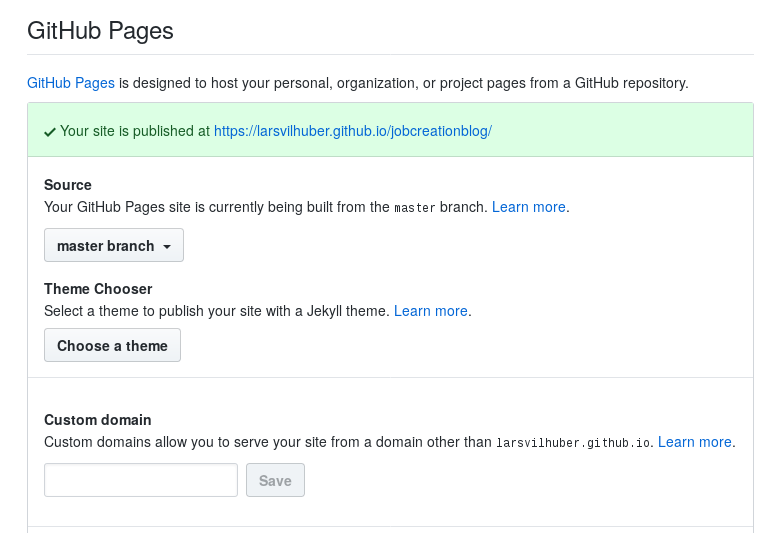
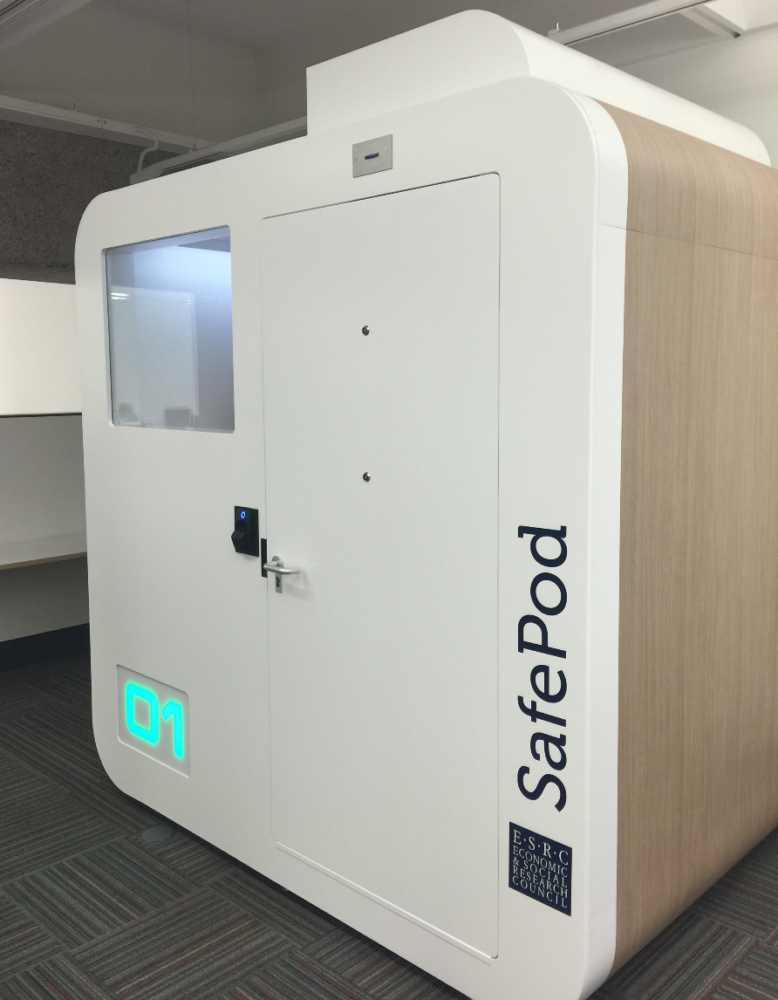

Replication and Reproducibility in Social Sciences and Statistics: Day 2
========================================================
author: Lars Vilhuber
date: 2019-10-02
autosize: true
width: 1200

Cornell University


When we stopped
==========

## Recording and documenting changes
- using Git**b! ✔️

## Making the data permanent
- using Zenodo again


***
## Making the page more permanent

- Using [Zenodo](zenodo.html)

## Making the page more accessible

- [on Github](github-pages.html)
- on Gitlab


How permanent is the data?
=========================
type: section

The data is obtained from a Census Bureau website.
- The website http://www2.census.gov/ces/bds/ might be re-organized and disappear
- The data format might change
- The API might change
- We only need two small chunks of code

Making the data more permanent
=============================

## Multiple options
  -  [Dryad Digital Repository](http://datadryad.org/)
  -  [figshare](http://figshare.com/)
  -  [Harvard Dataverse Network](http://thedata.harvard.edu/dvn/)
  -  [ICPSR](https://www.icpsr.umich.edu/icpsrweb/) and [OPENICPSR](https://www.openicpsr.org/openicpsr/)
  -  [Open Science Framework](http://osf.io/)
  -  [Zenodo](http://zenodo.org/)
  
***

We will use Zenodo, but all the others are just as good!
- We will upload manually, but there's also an API

[](https://zenodo.org)


Getting started on Zenodo
=========================
type: prompt
incremental: false

We will NOT use the regular Zenodo; rather, we will test in the Sandbox. 


**https://sandbox.zenodo.org/**


Check your URL bar! There's no other indication that this is not the real Zenodo!

***

## Tutorial:

https://library.cfa.harvard.edu/data-archiving-and-sharing (Harvard Center for Astrophysics)


## Source data (listed in the R code):

- http://www2.census.gov/ces/bds/firm/bds_f_age_release.csv
- http://www2.census.gov/ces/bds/firm/bds_f_all_release.csv


Do it now
==========
type: section

<div style="text-align: center;">

</div>

Result
=======

<div style="text-align: center;">

</div>


Result
=======

<div style="text-align: center;">

</div>


DOI and Linkages
=======

<div style="text-align: center;">

</div>

Result
======

> Goal 2: Be able to curate the data and code necessary for reproducible analysis

We have archived unreliable data in a reliable location. ✔️


Adding configuration information
===============================
We can now use the following information to augment the replication:


```r
# Zenodo DOI
zenodo.prefix <- "10.5281/zenodo"
# Specific DOI - resolves to a fixed version
zenodo.id <- "2649598"
# We will recover the rest from Zenodo API
zenodo.api = "https://zenodo.org/api/records/"
```


(Behind the scenes)
==================
We will parse the information that Zenodo gives us through an API:

> https://zenodo.org/api/records/2649598

<div style="text-align: center;">

</div>


Automating the data acquisition
==========================


```r
# needs rjson, tidyr, dplyr
```
We download the metadata from the API:

```r
download.file(paste0(zenodo.api,zenodo.id),destfile=file.path(dataloc,"metadata.json"))
```
We read the JSON in:

```r
latest <- fromJSON(file=file.path(dataloc,"metadata.json"))
```
We get the links to the actual CSV files (and the codebook):

```r
file.list <- as.data.frame(latest$files) %>% select(starts_with("self")) %>% gather()
```
We download all the csv files, by looking whether the filename has `csv` in it:

```r
for ( value in file.list$value ) {
	print(value)
	if ( grepl("csv",value ) ) {
	    print("Downloading...")
	    file.name <- basename(value)
	    download.file(value,destfile=file.path(dataloc,basename(value)))
	}
}
```


Adding it to your copy of the code
=================================
You can now add this to your copy of the code:


Result
======
type: prompt

> Goal 3: Robustness and automation - getting close to push-button reproducibility

Hold on
=======
type: alert


<div style="text-align: center;">

</div>


Another goal
============

> Goal 4: Correctly document reproducible research

And: not make your collaborators mad...


Making code changes cautiously (branching)
========================
## If we want to incorporate the Zenodo data
We could
- make all the changes right away
- possibly mess up the live site/ latest version of the paper?
- maybe annoy our co-authors?

***
## But we used a version control system with **branching**!
We instead
- create a new branch `zenodo`
- made all the changes there
- can compare the changes to the `main` branch
- consult with our co-authors before pulling the changes back into the main branch
- our live site/paper remains valid the entire time

Do it now
=========
- create a new branch `zenodo`
- copy the code from my repository (reference: https://github.com/larsvilhuber/jobcreationblog/blob/zenodo/01_download_replication_data.R)
- test that it works (hit `Knit`)
- commit to your own repository
- push to Git**b


<div style="text-align: center;">

</div>


Compare the changes: Version Control
===================
You can compare the changes: <small>https://gitlab.com/larsvilhuber/jobcreationblog/compare/master...zenodo?view=parallel</small>

<div style="text-align: center;">

</div>

Compare the changes: Version Control
===================

We could then proceed to incorporate (**pull** or **merge**) the changes into the `main` repository:

<div style="text-align: center;">

</div>

Read more about it at 
- https://help.github.com/en/articles/about-pull-requests
- https://docs.gitlab.com/ee/gitlab-basics/add-merge-request.html 

Final result
============
The final result 

- will pull data from Zenodo
- will reliably reproduce the graph as presented today
- will use citable data (`DOI = 10.5281/zenodo.2649598`)
- will have been achieved using replicable methods (before/ after)


Lessons learned
===============


##  Goal 1: Identify all the elements of a fully reproducible analysis

Data, source document, dependencies

## Goal 2: Be able to curate the data and code necessary for reproducible analysis

So far:
- source document
- Gitlab
- **input data** ✔️

Still left:
- output document

***

## Goal 3: Robustness and automation - getting close to push-button reproducibility
- Rmarkdown document has code, text, and figures 
- Dependencies identified, addressed
- **Download automated** ✔️

## Goal 4: Correctly document reproducible research
- Gitlab version control to document changes
- Documenting dependencies for clarity
- **Incorporating changes in a transparent (reproducible) way** ✔️


Now
===
<div style="text-align: center;">
<a href="https://pixabay.com/photos/coffee-cafe-cup-drink-breakfast-821490/"></a>
</div>


Next steps
==========
- Making your research visible
- Archiving your research


Making your research visible
===========================

Github Pages and Gitlab Pages are an easy way to publish project pages

- You've alread seen one: the original replication project page: 

https://larsvilhuber.github.io/jobcreationblog/README.html

***


How do Github Pages work?
========================

- Will display "static" web pages
  - like the HTML page generated by the Knit button
- Needs to be configured from the Settings

***





Now we have a web page!
=====================
type: alert

Didn't we say those are not archives?


How to create an archive from your research project
==================================================
- Only works with Github (for now)
- Log on to Zenodo
- Go to [Account -> Settings -> Github](https://sandbox.zenodo.org/account/settings/github/)
- Connect your Github account

<div style="text-align: center;">

</div>


Create a release
==================================================
<div style="text-align: center;">

</div>


Create a release
==================================================
<div style="text-align: center;">

</div>


Automatically creates an archive on Zenodo
==================================================
!(release)[images/Github_Releases_2.png]

***


!(release)[images/Github_Zenodo_4.png]


Final result
============
The final result 

- pulls data from Zenodo
- reliably reproduces the graph as presented today
- uses citable data (`DOI = 10.5281/zenodo.2649598`)
- was achieved using replicable methods (before/ after is viewable)
- **is citable itself (`DOI = 10.5281/zenodo.400356`)**
- **is accessible (
https://larsvilhuber.github.io/jobcreationblog/README.html)**


Lessons learned
===============


##  Goal 1: Identify all the elements of a fully reproducible analysis

Data, source document, dependencies

## Goal 2: Be able to curate the data and code necessary for reproducible analysis

- source document
- Gitlab
- input data 
- output document ✔️

***

## Goal 3: Robustness and automation - getting close to push-button reproducibility
- Rmarkdown document has code, text, and figures 
- Dependencies identified, addressed
- Download automated

## Goal 4: Correctly document reproducible research
- Gitlab version control to document changes
- Documenting dependencies for clarity
- Incorporating changes in a transparent (reproducible) way


Conclusion
==========
type: section

Conclusion
==========
## Replication can be a lot of work
We've touched on
- Replication per se
- Replicable documents
- Possible pitfalls of software dependencies
- Cloud computing platforms
- Permanence of source material (website, data) and how to solve it

***


Conclusion
==========

## We have not covered everything
... because there can be a lot more
- HP computing <small>(length, quantity, throughput)</small>
- Issues with commercial (paid) software <small>(access, permanence)</small>
- Data that is not public-use
- Data in a locked room

***


Thank you
==========
type: section

Presentation: https://labordynamicsinstitute.github.io/replication-tutorial-2019

Source: https://github.com/labordynamicsinstitute/replication-tutorial-2019
