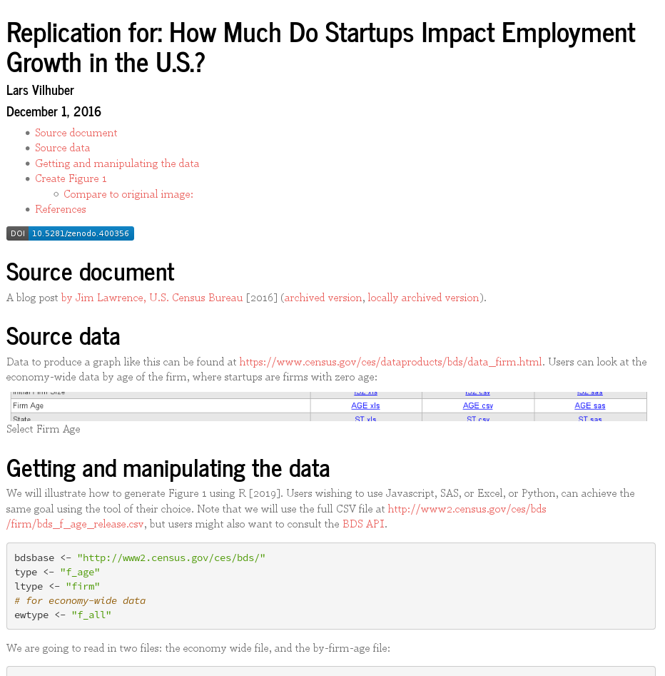

Making the page more accessible
========================================================
author: Lars Vilhuber
date: 2019-09-30
autosize: true
width: 1200

Making the page more accessible
===============================
Initially, you saw this 

***
But the code behind it is at https://github.com/larsvilhuber/jobcreationblog 

Creating a webpage from Github-hosted code
==========================================
- Go into the settings
- Tick the box to make it visible
- Ensure that you have HTML pages ("Github Pages" does not render Markdown)

***

Having Github (and some friends) create a webpage
================================================
## We can go one step further
- Have the document be created automatically when we change and commit
  - R code would be run "in the cloud" (not on Rstudio.cloud manually)
  - automatically! 
  - See https://docs.travis-ci.com/user/languages/r/ for more details
  
***

## Challenges
- Code needs to be replicable!
  - all the dependencies need to be solved in our code
  - won't work for paid-for software (Stata, SPSS, SAS)
 
