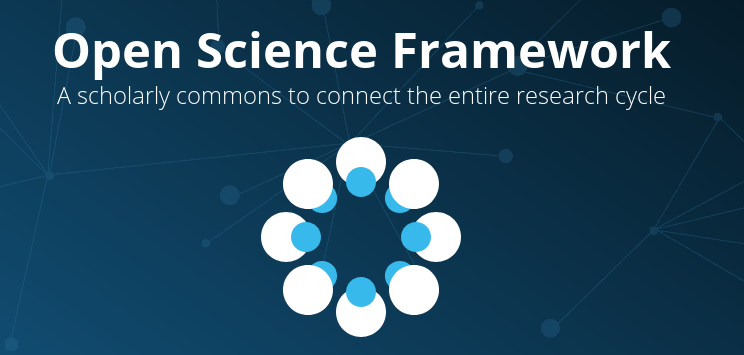
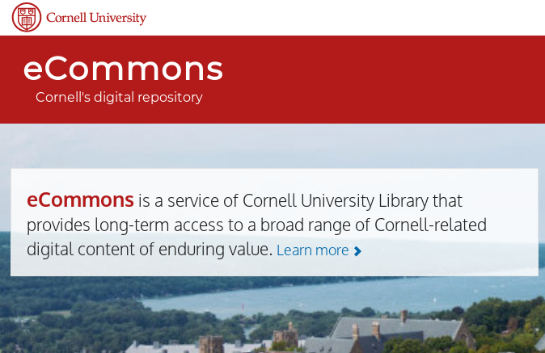
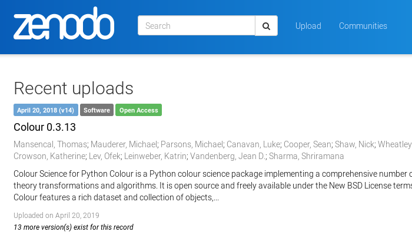
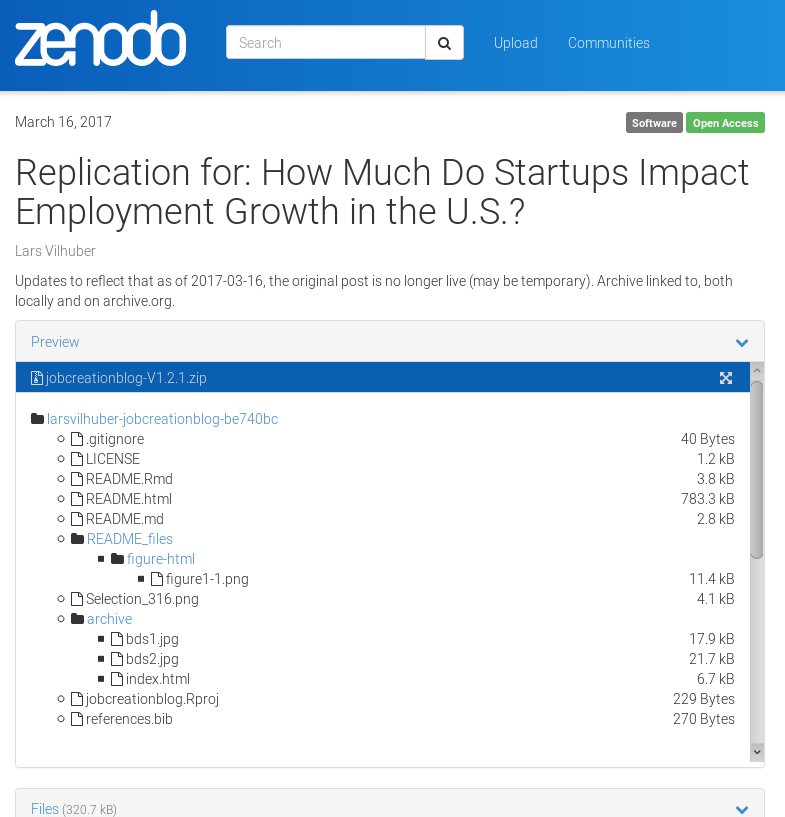

Archiving a document on Zenodo
========================================================
author: Lars Vilhuber
date: 2019-09-30
autosize: true
width: 1200

Making the document more permanent
==================================
type: section

Making the document more permanent
==================================

- we could have started on the Open Science Framework (possibly)

***
- we could create a PDF and store it on Cornell's eCommons

- we could submit to a journal!

We are going to use Zenodo
==========================
incremental: true

Zenodo is the social-science (general-purpose) repository managed by CERN

***

Why Zenodo?
===========
## Because it makes it really easy
- create a hook from Zenodo to Github
- create a release on Github
- a permanent record remains on Zenodo with a DOI 
  - even if you delete your Github repo!

For more info, see https://guides.github.com/activities/citable-code/
  
***

